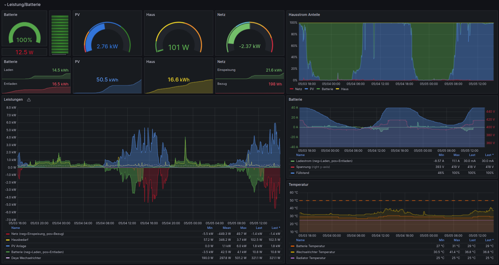
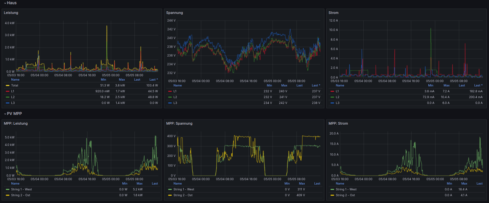
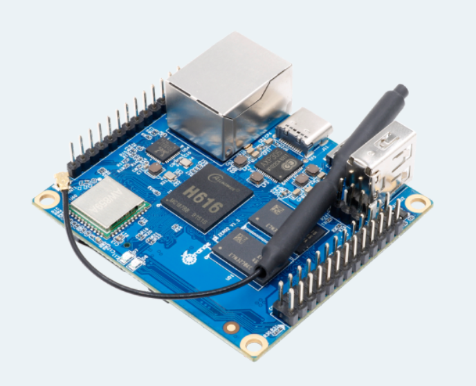
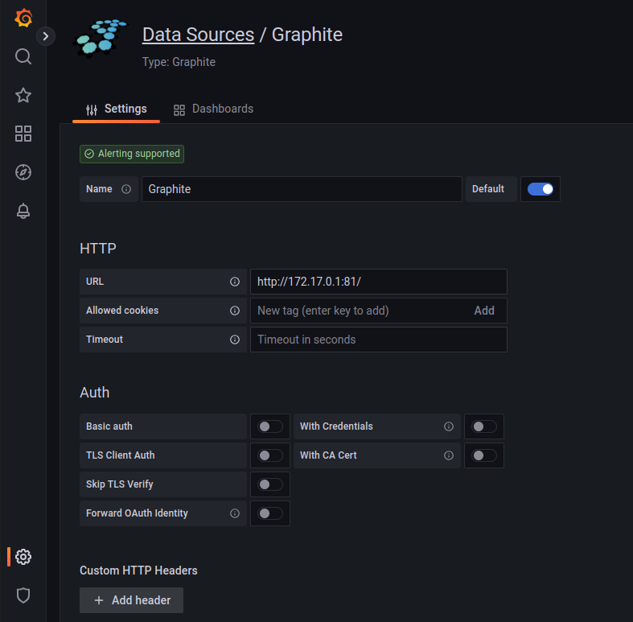

# DEYE Grafana monitor (SG01HP3)

Author: Stephan Enderlein
License: BSD 3-Clause License

Die verwendeten Tools und anderen Container haben eigene Lizensen, die
beachten werden müssen.

 

Dieses Repo ist nur eine kleine Sammlung an Infos,
um ein PV Monitor via Grafana für DEYE SG01HP3 (andere sind möglich) aufzubauen.

Aufgebaut habe ich das mit:
- Orange Pi Zero 2 (sollte auf jeden Linux system funktionieren)
- Docker Image: Grafana
- Docker Image: graphite (Datenbank)
- SD Card
- SSD Disk

 

Die SDCard wird zum Booten des OrangePi verwendet. Die gesamte Installation erfolgte im ersten Schritt auf der SDCard.
- Anpassen der /etc/fstab: Hier müssen aber etwas die parameter angepasst werden, damit beim stromausfall möglichst kein FS Schaden entsteht.
`UUID=5e468073-a25c-4048-be42-7f5cfc36ce25 / ext4 defaults,noatime,sync,discard,data_err=ignore,errors=continue,nocheck 0 1`

In einem späteren Schritt, habe ich
die SDCARD auf die SSD komplett kopiert (gecloned mit balenaEtcher).
Dabei werden alle UUIDs der Speichermediums auch kopiert.
/boot/orangepiEnv.txt und /etc/fstab haben damit auf der SSD die richigen
Werte. \
Damit es zu keinen konflikt kommt, muss die UUID der SDCard geändert werden.

Grund ist, dass eine SSD für die vielen Schreibzugriffe optimiert ist und eine SDCard nach kurzer Zeit kaputt geht.

~~~sh
# show all UUIDs
blkid

# SDCARD
#      assign new UUID to sdcard partion (welche gebootet werden soll)
tune2fs -U random /dev/mmcblk0p1

#      andern der PARTUUID
#      x - expert
#      i - anpassen der PartionTableUUID, die fuer partionen verwendet wird.
#      0x11223344
#      r - return main menu
#      w - write+exit (dauert etwas)
fdisk /dev/mmcblk0

# SSD
#      partion der ssd erweitern
#       parted> print
#       parted> resizepart 1 100%
#       parted> quit
parted /dev/sdb

# filesystem erweitern
> e2fsck -f /dev/sdb1
> resize2fs /dev/sdb1

~~~

Ich werde hier nur Anhaltspunkte geben und meine Scripts beschreiben. Infos
zur Installation oder das Clonen auf eine SSD+Anpassung von /boot/... lassen
sich gut im Internet suchen. 

## Arbeitsweise
Nach dem Booten werden drei Docker-Images (automatisch) und das collect-data.sh script gestartet.
Der Docker-Container 'deye-mqtt' ruft alle verfügbaren Daten vom Deye ab und stellt diese via mqtt bereit. \
collect-data.sh nutzt einen mqtt-cli client (https://mqttx.app/), um diese Daten vom Container abzurufen und diese in eine Datenbank (graphite) zuspeichern. \
Der Container 'grafana' stellt die Webseite bereit, welche sich den Daten aus
der Datenbank bedient.

# Schritte
- Installieren eines Linux auf OrangePi. Es gehen auch andere Boards wie RaspberryPi, oder auch VM.
Der OrangePi braucht dafür Internetzugang. Netzwerk kann wie beim RaspberryPi
mit dem Tool: 'orangepi-config' konfiguriert werden.

- Kopieren der "files/..." an entsprechende Stelle
- docker container deye-mqtt, Grafana und Graphite konfigurieren und einmalig starten (start-.....sh). Die Container starten nach dem Booten immer automatisch, so dass die start-scripts nicht noch einmal aufgerufen werden müssen.
- Automatisches Starten von /etc/deye einrichten.

## Notwendige Pakete

~~~sh
# bash (shell), normalerweise vorhanden
> apt install bash

# docker
> apt install docker.io

# nc (netcat Netzwerktool um Daten zu senden)
> apt install netcat

# jq (json command line parser)
> apt install jq

# bc (command line calulator)
> apt install bc

# MQTT brocker
apt install mosquitto
~~~

## Einrichten des Deye-MQTT Containers
Quelle: https://github.com/kbialek/deye-inverter-mqtt

Der Docker-Container sammelt Daten vom Deye via Deye-Wifi-Datenlogger
und sendet diese an einen MQTT Broker. \
In unserem Fall ist das der lokal (auf dem OrangePi) laufende _mosquitto_. \
Das script _pv-monitor-deye/files/root/collect-data.sh_ ruft diese Daten via command line tool _mqttx-cli_ ab und sendet diese an die Graphite-Datenbank.

Der Deye-MQTT Container muss für den verwendeten Wechselrichter und dem MQTT Broker konfiguriert werden. Die Konfiguration wird beim Start des Containers via File _pv-monitor-deye/files/root/deye-docker.env_ als Umgebungsvariablen übergeben.

~~~sh
# sun-15k-sg01hp3-eu-am2
# IP Addresse des Deye-Wifi-Datenloggers
DEYE_LOGGER_IP_ADDRESS=192.168.2.122
# Port nummer des Deye-Wifi-Datenloggers
DEYE_LOGGER_PORT=8899
# Seriennummer (Wichtig) Deye-Wifi-Datenloggers
DEYE_LOGGER_SERIAL_NUMBER=<logger serial>
DEYE_LOGGER_PROTOCOL=tcp
# Diese Gruppen entscheiden darüber, welche Daten abgefragt werden.
# Das hängt vom Type des Wechselrichters ab und muss evt angepasst werden.
# Siehe dazu das GitHub Projekt (https://github.com/kbialek/deye-inverter-mqtt)
DEYE_METRIC_GROUPS=deye_sg01hp3,deye_sg01hp3_battery,deye_sg01hp3_ups,deye_sg01hp3_bms
DEYE_DATA_READ_INTERVAL=10
MQTT_HOST=172.17.0.1
~~~

~~~sh
# Start des Containers:
> ./pv-monitor-deye/files/root/start-deye-mqtt.sh
~~~

## Einrichtung/Starten Grafana
__Script__: pv-monitor-deye/files/root/start-grafana.sh
~~~sh
#!/bin/bash

GRAFANA_BASE="/root/grafana/data"

# Das Datenverzeichniss für Grafana habe ich im Homeverzeichniss von Root
mkdir -p ${GRAFANA_BASE}

# start docker as deamon. das fuellt auch das datenverzeichniss
docker run -d \
	--name grafana \
	--restart=always \
	-u $(id -u) \
	-v "${GRAFANA_BASE}:/var/lib/grafana" \
	-p 80:3000 \
	grafana/grafana-oss
~~~

* Optional anpassen des Passworts:
~~~sh
# commando zeile des containers:
> docker exec -ti grafana bash

# admin passwort zueruck gesetzt auf "admin" . beim login wird dann nach neuem passwort gefragt, was aber aber "geskipped" werden kann (jedes mal)
> grafana-cli admin reset-admin-password "admin"
~~~

 Weitere Infos: grafana-cli: https://grafana.com/docs/grafana/v9.3/cli/

### Data-Source Plugin
Wenn Graphana läuft, muss das Plugin `Graphite` installiert werden, damit dieses als Data-Source für die Datenbank verfügbar ist.
- Plugin Graphite installieren
- Datasource konfigurieren (images/grafana-data-sources.png)
- Configuration-Preferences `Home Dashboard` wählen damit es als default erscheint

### Konfiguration
Als Datasource habe ich Graphite gewählt, weil ich da Daten einfach pushen kann.
Die Datenbank wird erst mit dem ersten Pushen angelegt. Das Schema wie
die Daten in welcher Auflösung gespeichert werden, sind in *graphite-data/graphite/conf/storage-schemas.conf* definiert.

Als IP für die Datensource kann ich im Grafana nicht _localhost_ konfigurieren, da Grafana und Graphite im Docker-Container laufen und damit ihr eigenes localhost haben.

**Lösung**: die IP von docker nutzen `172.17.0.1` (siehe images/grafana-data-sources.png) 
Alle Docker-Instanzen, nutzen ein eigenes Netz im Bereich 172.17.x.x was
durch Docker selbst angelegt wurde.

Das Dashboard von Grafana ist normaler erst nach Login erreichbar. Um es ohne Login (readonly) zu erreichen, muss es öffentlich gemacht werden. 
Das muss innerhalb des Containers von Grafana aktiviert werden.
Infos: https://grafana.com/docs/grafana/v9.3/setup-grafana/configure-security/configure-authentication/

Es ist wichtig, dass **org_name** mit dem vom Dashboard übereinstimmt, sonst kommt immer die "login" Seite.
Siehe dazu: http://<ip>/admin/orgs

~~~sh
# um eine shell im laufenden container zu bekommen
> docker exec -it grafana bash

# Anpassen der Grafana Konfiguration in
# /usr/share/grafana/conf/default.ini
> vi /usr/share/grafana/conf/default.ini
~~~

Beispiel:
~~~sh
#################################### Anonymous Auth ######################
[auth.anonymous]
# enable anonymous access
enabled = true

# specify organization name that should be used for unauthenticated users
org_name = PVMonitor

# specify role for unauthenticated users
org_role = Viewer

# mask the Grafana version number for unauthenticated users
hide_version = false
~~~

## Dashboard
Das Dashboard kann als Json in Grafana importiert werden. Dieses enthält alles was zur Anzeige benötigt wird.
Via Webfrontend unter Dashboards:
- Erzeugen eines neuen Ordners "PVMonitor"
- via "New" das dashboard json importieren (pv-monitor-deye/files/root/dashboard-json-model.json)

## Graphite (Datenbank)

Beim initialen Start des Containers "bind-mount" ich das Datenverzeichnis in den Container, damit ich die Daten immer habe und leichter sichern kann. Diese liegen somit nicht im Container, sondern direkt im Filesystem des OrangePi (falls dieser mal neu aufgesetzt werden muss).

Zur Fehlersuche kann auch direkt auf die Webseite von graphite zugegriffen werden (`http://<ip>:81/`)

__Script__: start-graphite.sh
~~~sh
#!/bin/bash

GRAPHITE_BASE="/root/graphite-data"

mkdir -p ${GRAPHITE_BASE}/statsd/config ${GRAPHITE_BASE}/graphite/storage ${GRAPHITE_BASE}/graphite/conf

# nutze standard retension (das ist genauer als ich es hatte)
docker run -d \
 --name graphite \
 --restart=always \
 -v ${GRAPHITE_BASE}/graphite/conf:/opt/graphite/conf \
 -v ${GRAPHITE_BASE}/graphite/storage:/opt/graphite/storage \
 -v ${GRAPHITE_BASE}/statsd/config:/opt/statsd/config \
 -p 81:80 \
 -p 2003-2004:2003-2004 \
 -p 2023-2024:2023-2024 \
 -p 8125:8125/udp \
 -p 8126:8126 \
 graphiteapp/graphite-statsd
~~~

Beim Starten des Containers werden alle notwendigen Files in diesem gemounteten Datenordner angelegt. Das Konfig-file, welches die Auflösung der Daten und den Umfang definert ist im file /root/graphite-data/graphite/conf/storage-schemas.conf hinterlegt, braucht aber nicht angepasst zu werden, da dieses schon optimal sind. 

**Hinweis**: Ich habe im Nachgang versucht, die Datenbank bezüglich der Auflösung für bestimmte Zeitperioden anzupassen. Das hat nicht so richtig funktioniert. Daten sind dabei teilweise verloren gegangen. 
Daher sollte beim ersten Konfigurieren des Datalayouts von graphite gut geplant werden, falls die Voreinstellung doch nicht so ist wie gewünscht. \
Generell wenn /opt/graphite/conf/storage-schemas.conf angepasst wird,
müssen auch die *wsp (Datenfiles) angepasst werden.
https://linuxboss.wordpress.com/2016/11/04/adjusting-retention-time-for-graphite-carbon-and-updating-whisper-files/

Wenn Authorisation auf die Datenbank gebraucht wird (was ich hier auf in so einer installation nicht brauche):
https://graphite.readthedocs.io/en/1.1.10/config-local-settings.html?highlight=authorize#dashboard-authorization-configuration  
~~~sh
docker exec -it graphite sh
# und dann die /opt/graphite/webapp/graphite/local_settings.py anpassen (DASHBOARD_REQUIRE_AUTHENTICATION)
~~~

# Booting
Beim Booten des OrangePi muss das *collect-data.sh* automatisch starten. (Die Docker-Container werden bereits automatisch gestartet.) 
Dazu muss in `/etc/rc.local` das script eingebunden werden (einfachster Weg). Falls bereits eigene Änderungen
gemacht wurden, dann die entsprechende Zeilen aus der rc.local (im repo) dort einfügen.

__Start-Script:__
~~~sh
./pv-monitor-deye/files/etc/init.d/deye start
~~~

Diese Script schaltet auch IPV6 ab und setzt die filewall Regeln.

## Sonstiges

Werden Anpassungen innerhalb eines Containers gemacht, müssen die services neu gestartet werden.
~~~sh
# oder ausserhalb:
docker restart grafana graphite deye-mqtt
~~~

Das *backup.sh* Script erlaubt es, ab und zu ein manuelles Backup zu machen. ;-)

Auf dem Gerät laufen zum Schluss drei docker container und das collect-data.sh script, wenn alles läuft.

~~~sh
# Anzeige der laufenden Container
> docker ps
~~~
